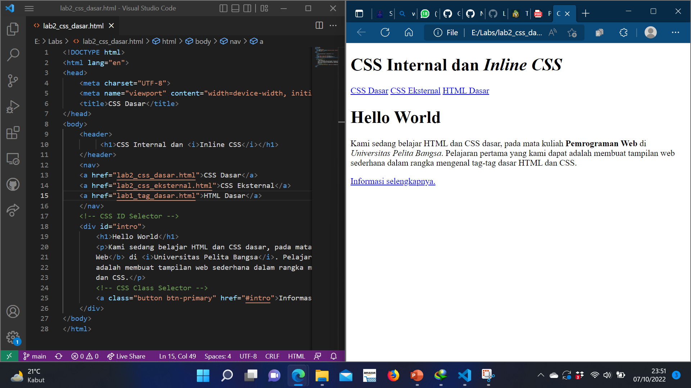
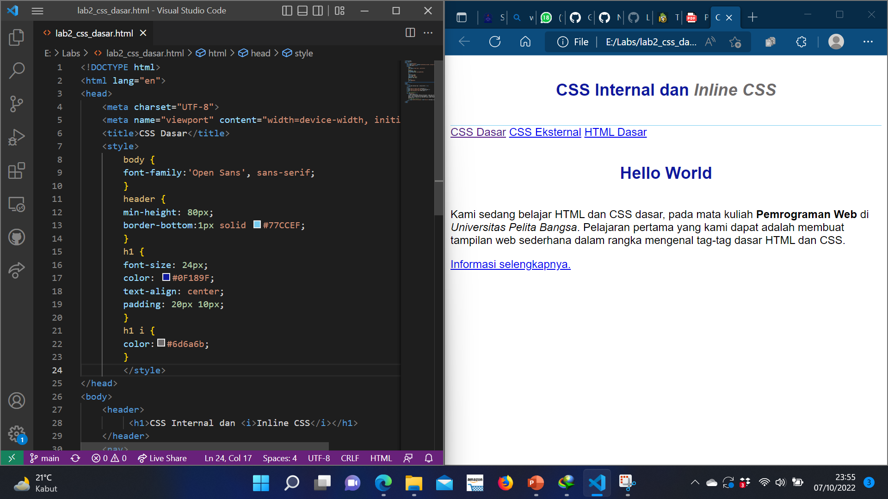
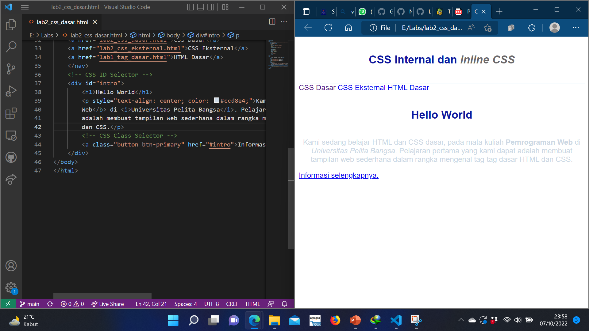
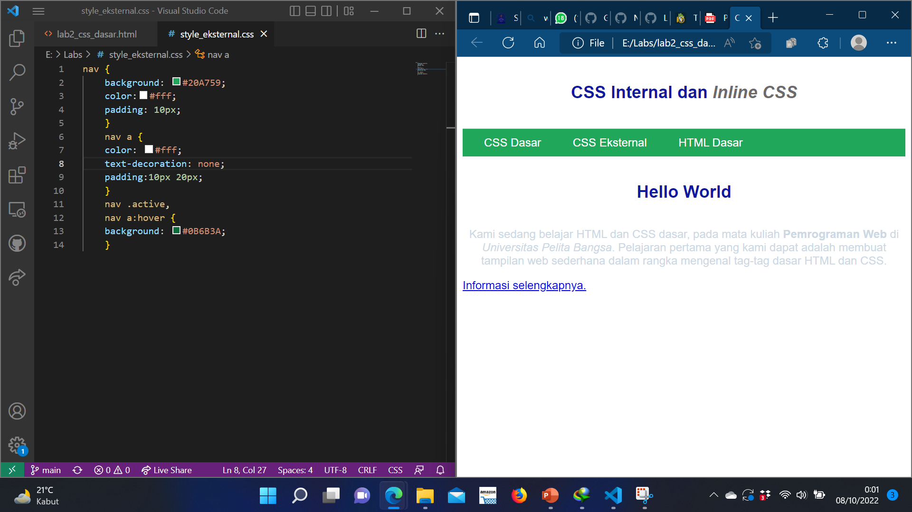
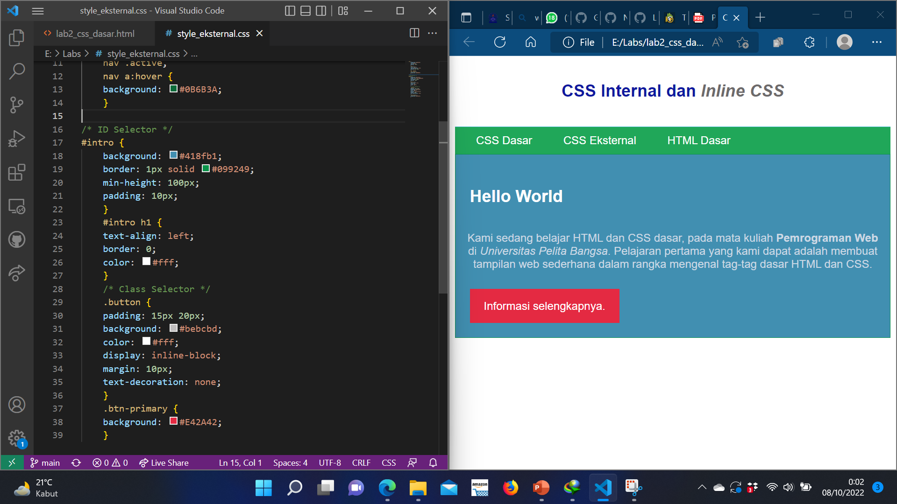

# Lab2Web
nama : Arif Ramadhan
NIM : 312110480

# Langkah-langkah Praktikum
# 1. Membuat dokumen HTML
Buatlah dokumen HTML seperti berikut

# 2. Mendeklarasikan CSS Internal
Kemudian tambahkan deklarasi CSS internal seperti berikut pada bagian head dokumen.

# 3. Menambahkan Inline CSS
Kemudian tambahkan deklarasi inline CSS pada tag p seperti berikut.

# 4. Membuat CSS Eksternal
Buatlah file baru dengan nama style_eksternal.css kemudian buatlah deklarasi CSS seperti berikut.
Kemudian tambahkan tag link untuk merujuk file css yang sudah dibuat pada bagian head

# 5. Menambahkan CSS Selector
Selanjutnya menambahkan CSS Selector menggunakan ID dan Class Selector. Pada file 
style_eksternal.css, tambahkan kode berikut.

